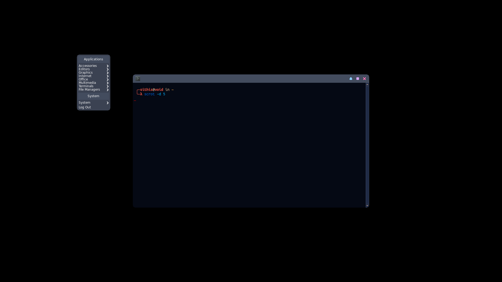

# Fork Features

* Removed handle on window max
* Arch PKGBUILD
* make focus cycle themeable by stfnwp 
* Default horzontal alt tab with reduced hilite
* More visible focus cycle indicator patch by [joaotavora](https://github.com/joaotavora/openbox/commit/55a73d9901fbac01268684fa352502ef65b59699)
* Removed default themes and replaced with Joy and Box by [owl4ce](https://github.com/owl4ce/yao)
* rounded corners with configurable bottom. (JJMorton) `<cornerRadius>8</cornerRadius>` 

Argument description | Example
------------ | -------------
Enable rounded corners on menus | menu="yes"
Enable rounded corners on window bottom | bottom="yes"

* Stop Hidden (Vitaly Minko)
`
  <application class="Firefox">
    <stop_hidden>group</stop_hidden>
  </application>
`

Value description | Example
------------ | -------------
do not stop application when it hides (default value) | no
stop just the process the hidden window belongs to | process
Stops the entire process group including processes spawned by it | group

* HJKL motion keys (mstuehn)
* Allow changing debug mode on the fly on a running wm (paulie-g)
* Window snapping (emilypeto)
* Cycle through the windows with the arrow keys (M374LX)
* utf8 unicode support for menu accelerators (paulie-g)

>Must be enabled `<utf8Enabled>yes</utf8Enabled>` and `<utf8AllowGraph>yes</utf8AllowGraph>`

* Scripts updated to Python 3 (troycurtisjr)
* Added allMonitors option to NextWindow and PreviousWindow (yut23)
>Enabled by default for backwards compatibility.
If disabled, the window switcher will only show windows from the current
monitor (for now, that's where the pointer is). The popup will stay on
that monitor until a window is selected, even the pointer moves to
another monitor.

>To implement this efficiently, I have each client keep track of their
current monitor. This may need more extensive testing to make sure it
doesn't miss any movement methods. ~ Yut23 commit
## Bug fixes
* g_memdup -> g_memdup2 deprication fix
* Compiler deprication warning fixes (yut23)
* 2018 Debian fixes by photon
* Fix: bug #6362: desktop window may be set to skip the taskbar - they usually are (paulie-g)
* Fix loosing focus while moving windows (Andrey Dotsenko)
## Developer Features
* VS Code task
# Openbox

Copyright (C) 2004  Mikael Magnusson

Copyright (C) 2002  Dana Jansens

----

    This software is OSI Certified Open Source Software.
    OSI Certified is a certification mark of the Open Source Initiative.

----

    This program is free software; you can redistribute it and/or modify
    it under the terms of the GNU General Public License as published by
    the Free Software Foundation; either version 2 of the License, or
    (at your option) any later version.

    This program is distributed in the hope that it will be useful,
    but WITHOUT ANY WARRANTY; without even the implied warranty of
    MERCHANTABILITY or FITNESS FOR A PARTICULAR PURPOSE.  See the
    GNU General Public License for more details.

    See the COPYING file for a copy of the GNU General Public License.

